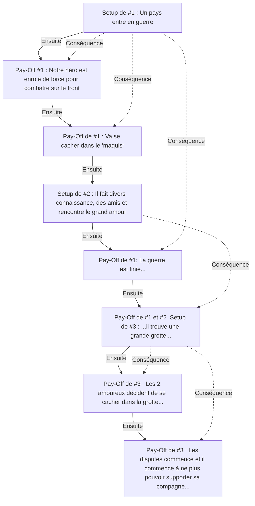

{#1|Un pays entre en guerre.}

{#1|Notre héro est enrolé de force pour combatre sur le front.}

{#1|Il y vois les attrocité de la guerre et déserte et va se cacher dans le 'maquis'.}

{#2|Il fait divers connaissance, des amis et rencontre le grand amour.}

{#1|La guerre est finie, le maquis est encerclé et les déserteur et les traitres sont pourchassé et exécuté un par un.

{#1, #2, #3|Alors que ces amis du maquis commencent à ce faire tuer, il trouve une grande grotte, avec un petit étang intérieur avec des poissons, ainsi que des végéteaux comestibles grace à des criteaux lumineux présent sur les parois de la grotte.}

{#3|Les 2 amoureux décident de se cacher ici, en faisant sauter l'entrée, pour que plus personnes ne viennent jamais les embéter et qu'ils puissent enfin vivre le grand amour.}

{#3|Finalement, avec le temps, les disputes commence et il commence à ne plus pouvoir supporter sa compagne, mais cette fois-ci, il ne peut plus fuir. Et la grotte porte au vent l'écho déformé de leurs disputes ; les locaux racontent souvent cette tragédie amoureuse et disent que quand la montagne gronde, c'est un mauvais présage pour tous les maris.}

--------------------------
Schéma de la trame narrative:

